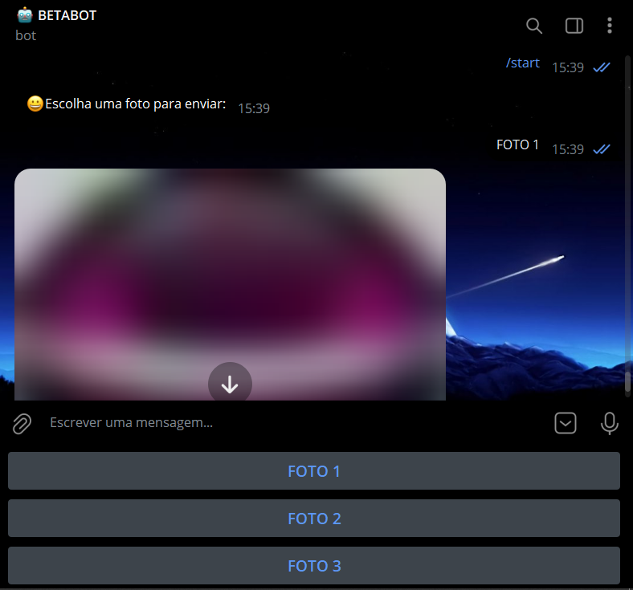

# BOTOES DE TECLADO
🌐O **BOT DE ENVIO DE FOTOS** É UM BOT DO TELEGRAM PROJETADO PARA ENVIAR FOTOS ESPECÍFICAS ARMAZENADAS EM UM DIRETÓRIO LOCAL (`./FOTOS`) AOS USUÁRIOS.

 <br>

## DESCRIÇÃO:
O **Bot de Envio de Fotos** é um bot do Telegram projetado para enviar fotos específicas armazenadas em um diretório local (`./FOTOS`) aos usuários. Ele cria um botão de teclado personalizado para cada foto disponível, permitindo que os usuários solicitem fotos específicas com apenas um clique.

## FUNCIONALIDADES:
1. **Mensagens de Boas-Vindas**:
    - Ao iniciar a interação com o comando `/start`, o bot exibe uma mensagem de boas-vindas e os botões de fotos.

2. **Listagem Dinâmica de Fotos**:
    - O bot lista todas as fotos disponíveis no diretório `./FOTOS` ao iniciar.
    - Cria um botão para cada foto, com rótulos como "FOTO 1", "FOTO 2", etc.

3. **Envio de Fotos**:
    - Quando um usuário clica em um botão, o bot envia a foto correspondente do diretório `./FOTOS`.

## EXECUTANDO O PROJETO:
1. **Coloque o Token:**
   - Antes de executar o programa, é necessário substituir o token do seu bot no arquivo `TOKEN.py`, o qual pode ser obtido por meio do [@BotFather](https://t.me/BotFather).

2. **Instalando as dependências:**
   - Antes de executar o bot, certifique-se de instalar todas as dependências necessárias. No terminal, execute o seguinte comando para instalar as dependências listadas no arquivo `requirements.txt` em `CODIGO`:
   ```bash
   pip install -r requirements.txt
   ```

3. **Modifique o Código:**
   - Coloque as fotos que deseja enviar no diretório `./FOTOS`.

4. **Inicie o Bot:**
   - Execute o bot do Telegram em Python iniciando-o com o seguinte comando:
   ```bash
   python CODIGO.py
   ```

5. **Interação com o Bot**:
   - No Telegram, inicie uma conversa com o bot e envie o comando `/start`.
   - O bot responderá com uma mensagem solicitando que o usuário escolha uma foto.
   - O teclado personalizado exibirá botões para cada foto disponível.
   - Clique em um dos botões (por exemplo, "FOTO 1") para receber a foto correspondente.

## NÃO SABE?
- Entendemos que para manipular arquivos em muitas linguagens e tecnologias relacionadas, é necessário possuir conhecimento nessas áreas. Para auxiliar nesse aprendizado, oferecemos alguns subsidios:
* [CURSO DE TELEBOT](https://github.com/VILHALVA/CURSO-DE-TELEBOT)
* [CURSO DE PYTHON](https://github.com/VILHALVA/CURSO-DE-PYTHON)
* [CONFIRA MAIS CURSOS](https://github.com/VILHALVA?tab=repositories&q=+topic:CURSO)

## CREDITOS:
- [PROJETO CRIADO PELO VILHALVA](https://github.com/VILHALVA)
